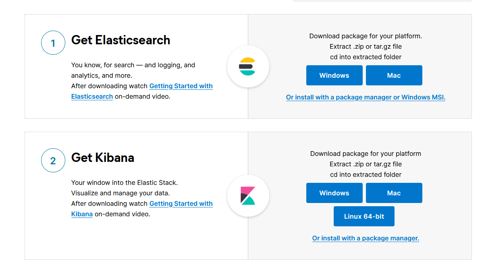

# ElasticSearch
 ELK:ElasticSearch、Logstash、Kibana

### Doug Cutting

lucene 全文检索 开源 信息检索工具包 jar包 不包含搜索引擎 solr

包含的索引结构。读写索引的工具

### lucene与es关系

es是基于lucene做了一定的封装和增强

## ElasticSearch概述

开源的分布式全文搜索引擎，可以近乎实时的存储、检索数据、本身扩展性很好，可以扩展到上百台服务器，处理PB级别的数据，es也使用java开发并使用lucene作为其核心是实现所有索引和搜素功能，但是他的目的是通过间的RESTful Api隐藏Lucene的复杂性，从而上全文搜索变得简单。

## Solr简介

## Lucene简介

### ES与Solr的差别

单纯的已有的数据进行搜索=>solr

当实时建立索引的时候 solr会残生io阻塞，查询性能较差。es有明显的优势

随着数据量的增加solr性能会变慢

## ElasticSearch安装

jdk最低jdk1.8 

https://www.elastic.co/cn/start



+ 目录

  > bin 启动文件
  >
  > config 配置文件
  >
  > ​	log4j 日志配置文件
  >
  > ​	jvm.option java虚拟机相关配置
  >
  > ​	elasticsearch.yml 配置文件  跨域
  >
  > lib 相关jar包
  >
  > modules 功能模块
  >
  > plugins 插件
  >
  > logs 日志

+ 启动

  bin/elasticsearch.bar


+ 访问127.0.0.1:9200

  ```json
  {
    "name" : "DESKTOP-B447GFQ",
    "cluster_name" : "elasticsearch",
    "cluster_uuid" : "BuOLCKXISE-YIaDbqY-tew",
    "version" : {
      "number" : "7.6.1",
      "build_flavor" : "default",
      "build_type" : "zip",
      "build_hash" : "aa751e09be0a5072e8570670309b1f12348f023b",
      "build_date" : "2020-02-29T00:15:25.529771Z",
      "build_snapshot" : false,
      "lucene_version" : "8.4.0",
      "minimum_wire_compatibility_version" : "6.8.0",
      "minimum_index_compatibility_version" : "6.0.0-beta1"
    },
    "tagline" : "You Know, for Search"
  }
  
  ```

+ 可视化界面安装 es-header

  > npm install 
  >
  > npm run start

+ 解决跨域问题 elasticsearch.yml

  ```yaml
  http.cors.enabled: true
  http.cors.allow-origin: "*"
  ```

+ 重启es服务 再次连接 


