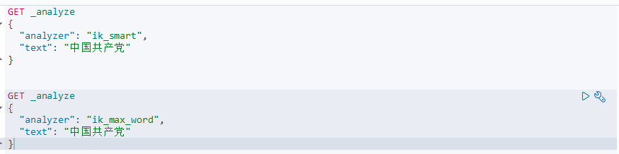
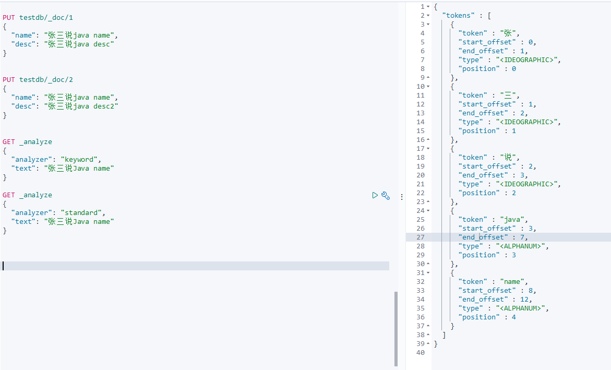

# ElasticSearch
 ELK:ElasticSearch、Logstash、Kibana

### Doug Cutting

lucene 全文检索 开源 信息检索工具包 jar包 不包含搜索引擎 solr

包含的索引结构。读写索引的工具

### lucene与es关系

es是基于lucene做了一定的封装和增强

## ElasticSearch概述

开源的分布式全文搜索引擎，可以近乎实时的存储、检索数据、本身扩展性很好，可以扩展到上百台服务器，处理PB级别的数据，es也使用java开发并使用lucene作为其核心是实现所有索引和搜素功能，但是他的目的是通过间的RESTful Api隐藏Lucene的复杂性，从而上全文搜索变得简单。

## Solr简介

## Lucene简介

### ES与Solr的差别

单纯的已有的数据进行搜索=>solr

当实时建立索引的时候 solr会残生io阻塞，查询性能较差。es有明显的优势

随着数据量的增加solr性能会变慢

## ElasticSearch安装

jdk最低jdk1.8 

https://www.elastic.co/cn/start


+ 目录

  > bin 启动文件
  >
  > config 配置文件
  >
  > ​	log4j 日志配置文件
  >
  > ​	jvm.option java虚拟机相关配置
  >
  > ​	elasticsearch.yml 配置文件  跨域
  >
  > lib 相关jar包
  >
  > modules 功能模块
  >
  > plugins 插件
  >
  > logs 日志

+ 启动

  bin/elasticsearch.bar


+ 访问127.0.0.1:9200

  ```json
  {
    "name" : "DESKTOP-B447GFQ",
    "cluster_name" : "elasticsearch",
    "cluster_uuid" : "BuOLCKXISE-YIaDbqY-tew",
    "version" : {
      "number" : "7.6.1",
      "build_flavor" : "default",
      "build_type" : "zip",
      "build_hash" : "aa751e09be0a5072e8570670309b1f12348f023b",
      "build_date" : "2020-02-29T00:15:25.529771Z",
      "build_snapshot" : false,
      "lucene_version" : "8.4.0",
      "minimum_wire_compatibility_version" : "6.8.0",
      "minimum_index_compatibility_version" : "6.0.0-beta1"
    },
    "tagline" : "You Know, for Search"
  }
  
  ```

+ 可视化界面安装 es-header

  > npm install 
  >
  > npm run start

+ 解决跨域问题 elasticsearch.yml

  ```yaml
  http.cors.enabled: true
  http.cors.allow-origin: "*"
  ```

+ 重启es服务 再次连接 

  索引可以理解为数据库


+ ELK

  数据清洗->搜索存储->kibana

## Kibana

针对es开源分析可视化平台 用来搜索查看交互存储在es索引中的数据，使用kibana可以通过各种图表进行高级数据分析、Kibana让海量数据更容易理解。

kibana和es的版本要一致


解压时间长，标准化前端工程

拆箱即用的

+ 启动

  bin/kibana.bat

  


## ES核心概念

集群 节点 索引 类型 文档 分配 映射

面向文档

| Relational DB | ElasticSearch |
| ------------- | ------------- |
| 数据库        | 索引          |
| 表            | types         |
| 行            | documents     |
| 字段          | fields        |

es把后台把每个索引分成多个切片，每份分片可以在集群中不同的服务器迁移

倒排索引

## IK分词器

如果使用中文，建议使用ik分词器


+ 查看加载的插件
+ cmd中elasticsearch-plugin list

查看不同的分词器效果



max_word最小粒度切分

自己需要的词语 需要自己加入分词器字典中

> ik分词器增加自己的配置


以后的话 我们需要自己配置分词就在自己定义的dic文件中进行配置即可

## Rest风格说明

### 创建一个索引

+ put

  ```
  PUT /索引名/~类型名~/文档id
  {请求体}
  ```

  完成了添加索引 数据添加成功 在初期可以当作数据库使用

  

  数据类型

  + 指定字段的类型

    ```
    PUT /test2
    {
      "mappings": {
        "properties": {
          "name":{
            "type": "text"
          },
          "age":{
            "type": "long"
          },
          "birth":{
            "type": "date"
          }
        }
      }
    }
    ```

+ get

  获取具体信息

  ```
  GET test2
  
  GET ntuzy/user/_search?q=name:ntuzy
  ```

  + 复杂查询

    ```
    GET ntuzy/user/_search
    {
      "query": {
        "match": {
          "name": "张三"
        }
      },
      // 结果过滤
      "_source": ["name","desc"]
    }
    
    
    // 通过字段排序
    GET ntuzy/user/_search
    {
      "query": {
        "match": {
          "name": "张三"
        }
      },
      "sort":[
        {
          "age": {
            "order": "asc"
          }
        }
      ],
      "from": 0,  // 从什么索引下标开始
      "size": 2 // 每页多少结果
    }
    
    
    // 多条件查询 must = and
    GET ntuzy/user/_search
    {
      "query": {
        "bool": {
          "must": [
            {
              "match": {
                "name": "张三"
              }
            },
            {
              "match": {
                "age": 3
              }
            }
          ]
        }
      }
    }
    
    // should = or
    // must_not = not
    GET ntuzy/user/_search
    {
      "query": {
        "bool": {
          "should": [
            {
              "match": {
                "name": "张三"
              }
            },
            {
              "match": {
                "age": 3
              }
            }
          ]
        }
      }
    }
    
    
    // 过滤
    GET ntuzy/user/_search
    {
      "query": {
        "bool": {
          "must": [
            {
              "match": {
                "name": "张三"
              }
            }
          ],
          "filter": {
            "range": {
              "age": {
                "gte": 10
              }
            }
          }
        }
      }
    }
    ```

  + 匹配多个条件

    多个条件之间用空格隔开

    ```
    GET ntuzy/user/_search
    {
      "query": {
        "match": {
          "tags": "男 技术"
        }
      }
    }
    ```

  + 精确查找

    term查询是直接通过倒排索引指定的词精确查找

    关于分词：

    term 直接精切查询

    match 会使用分词器解析

    两个类型

    text 会被分词器解析

    keyword 不会被分词器解析

    term同样可以多条件查询

    

  + 高亮查询

    

  + 自定义高亮

    

  + 查看默认信息

    ```json
    {
      "test3" : {
        "aliases" : { },
        "mappings" : {
          "properties" : {
            "age" : {
              "type" : "long"
            },
            "birth" : {
              "type" : "date"
            },
            "name" : {
              "type" : "text",
              "fields" : {
                "keyword" : {
                  "type" : "keyword",
                  "ignore_above" : 256
                }
              }
            }
          }
        },
        "settings" : {
          "index" : {
            "creation_date" : "1607945985550",
            "number_of_shards" : "1",
            "number_of_replicas" : "1",
            "uuid" : "-aNybPjgTFSSA54YCJATBA",
            "version" : {
              "created" : "7060199"
            },
            "provided_name" : "test3"
          }
        }
      }
    }
    
    ```

    如果自己的文档字段没有指定，那么es就会给我们默认配置字段类型

    通过命令elasticsearch

    > GET _cat/health
    >
    > GET _cat/indices?v

+ 更新: PUT 直接覆盖或者POST

  ```
  PUT /test1/type1/1
  {
    "name": "狂神说123",
    "age": 3
  }
  
  POST /test3/_doc/1/_update
  {
    "doc":{
      "name": "张三123"
    }
  }
  ```

+ delete

  ```
  delete test1
  ```

## 集成SpringBoot


+ pom.xml

  ```xml
  <?xml version="1.0" encoding="UTF-8"?>
  <project xmlns="http://maven.apache.org/POM/4.0.0" xmlns:xsi="http://www.w3.org/2001/XMLSchema-instance"
           xsi:schemaLocation="http://maven.apache.org/POM/4.0.0 https://maven.apache.org/xsd/maven-4.0.0.xsd">
      <modelVersion>4.0.0</modelVersion>
      <parent>
          <groupId>org.springframework.boot</groupId>
          <artifactId>spring-boot-starter-parent</artifactId>
          <version>2.2.5.RELEASE</version>
          <relativePath/> <!-- lookup parent from repository -->
      </parent>
      <groupId>com.ntuzy</groupId>
      <artifactId>ntuzy-es-api</artifactId>
      <version>0.0.1-SNAPSHOT</version>
      <name>ntuzy-es-api</name>
      <description>Demo project for Spring Boot</description>
  
      <properties>
          <java.version>1.8</java.version>
          <!-- 自定义es版本依赖 -->
          <elasticsearch.version>7.6.1</elasticsearch.version>
      </properties>
  
      <dependencies>
          <!-- 导入es -->
          <dependency>
              <groupId>org.springframework.boot</groupId>
              <artifactId>spring-boot-starter-data-elasticsearch</artifactId>
          </dependency>
          <dependency>
              <groupId>org.springframework.boot</groupId>
              <artifactId>spring-boot-starter-web</artifactId>
          </dependency>
  
          <dependency>
              <groupId>org.springframework.boot</groupId>
              <artifactId>spring-boot-devtools</artifactId>
              <scope>runtime</scope>
              <optional>true</optional>
          </dependency>
          <dependency>
              <groupId>org.springframework.boot</groupId>
              <artifactId>spring-boot-configuration-processor</artifactId>
              <optional>true</optional>
          </dependency>
          <dependency>
              <groupId>org.projectlombok</groupId>
              <artifactId>lombok</artifactId>
              <optional>true</optional>
          </dependency>
          <dependency>
              <groupId>org.springframework.boot</groupId>
              <artifactId>spring-boot-starter-test</artifactId>
              <scope>test</scope>
          </dependency>
      </dependencies>
  
      <build>
          <plugins>
              <plugin>
                  <groupId>org.springframework.boot</groupId>
                  <artifactId>spring-boot-maven-plugin</artifactId>
                  <configuration>
                      <excludes>
                          <exclude>
                              <groupId>org.projectlombok</groupId>
                              <artifactId>lombok</artifactId>
                          </exclude>
                      </excludes>
                  </configuration>
              </plugin>
          </plugins>
      </build>
  
  </project>
  
  ```

+ config

  ```java
  package com.ntuzy.config;
  
  import org.apache.http.HttpHost;
  import org.elasticsearch.client.RestClient;
  import org.elasticsearch.client.RestHighLevelClient;
  import org.springframework.context.annotation.Bean;
  import org.springframework.context.annotation.Configuration;
  
  
  // Spring两步骤
  // 找对象
  // 放到Spring中待用
  // 如果是SpringBoot 就先分析源码
  @Configuration
  public class ElasticSearchConfig {
  
      @Bean
      public RestHighLevelClient restHighLevelClient() {
          RestHighLevelClient client = new RestHighLevelClient(
                  RestClient.builder(new HttpHost("127.0.0.1", 9200, "http")));
  
          return client;
      }
  
  }
  
  ```

+ test

  ```java
  package com.ntuzy;
  
  import com.alibaba.fastjson.JSON;
  import com.ntuzy.pojo.User;
  import org.elasticsearch.action.admin.indices.delete.DeleteIndexRequest;
  import org.elasticsearch.action.bulk.BulkRequest;
  import org.elasticsearch.action.bulk.BulkResponse;
  import org.elasticsearch.action.delete.DeleteRequest;
  import org.elasticsearch.action.delete.DeleteResponse;
  import org.elasticsearch.action.get.GetRequest;
  import org.elasticsearch.action.get.GetResponse;
  import org.elasticsearch.action.index.IndexRequest;
  import org.elasticsearch.action.index.IndexResponse;
  import org.elasticsearch.action.search.SearchRequest;
  import org.elasticsearch.action.search.SearchResponse;
  import org.elasticsearch.action.support.master.AcknowledgedResponse;
  import org.elasticsearch.action.update.UpdateRequest;
  import org.elasticsearch.action.update.UpdateResponse;
  import org.elasticsearch.client.RequestOptions;
  import org.elasticsearch.client.RestHighLevelClient;
  import org.elasticsearch.client.indices.CreateIndexRequest;
  import org.elasticsearch.client.indices.CreateIndexResponse;
  import org.elasticsearch.client.indices.GetIndexRequest;
  import org.elasticsearch.common.unit.TimeValue;
  import org.elasticsearch.common.xcontent.XContentType;
  import org.elasticsearch.index.query.QueryBuilder;
  import org.elasticsearch.index.query.QueryBuilders;
  import org.elasticsearch.search.SearchHit;
  import org.elasticsearch.search.builder.SearchSourceBuilder;
  import org.elasticsearch.search.fetch.subphase.FetchSourceContext;
  import org.junit.jupiter.api.Test;
  import org.springframework.beans.factory.annotation.Autowired;
  import org.springframework.beans.factory.annotation.Qualifier;
  import org.springframework.boot.test.context.SpringBootTest;
  
  import java.io.IOException;
  import java.util.ArrayList;
  import java.util.concurrent.TimeUnit;
  
  /**
   * es 7.6.x api
   */
  @SpringBootTest
  class NtuzyEsApiApplicationTests {
  
  
      // 面向对象操作
      @Autowired
      @Qualifier("restHighLevelClient")
      private RestHighLevelClient client;
  
      // 测试索引的创建 request
      @Test
      void testCreateIndex() throws IOException {
          // 创建索引请求
          CreateIndexRequest request = new CreateIndexRequest("ntuzy_index");
          // 执行请求  请求后获得响应
          CreateIndexResponse createIndexResponse = client.indices().create(request, RequestOptions.DEFAULT);
  
          System.out.println(createIndexResponse);
      }
  
      // 测试获取索引
      @Test
      void testExistIndex() throws IOException {
          GetIndexRequest request = new GetIndexRequest("ntuzy_index");
          boolean exists = client.indices().exists(request, RequestOptions.DEFAULT);
          System.out.println(exists);
      }
  
      // 测试删除索引
      @Test
      void testDeleteIndex() throws IOException {
          DeleteIndexRequest request = new DeleteIndexRequest("ntuzy_index");
          AcknowledgedResponse delete = client.indices().delete(request, RequestOptions.DEFAULT);
          System.out.println(delete);
      }
  
  
      // 创建文档
      @Test
      void testAddDocument() throws IOException {
          // 创建对象
          User user = new User("ntuzy", 12);
          IndexRequest request = new IndexRequest("ntuzy_index");
  
  
          // 规则 put /ntuzy_index/_doc/1
          request.id("1");
          request.timeout(TimeValue.timeValueSeconds(1));
  
          request.timeout("1s");
  
          // 将我们的数据放入请求
          IndexRequest source = request.source(JSON.toJSONString(user), XContentType.JSON);
  
          // 客户端发送请求
          IndexResponse indexResponse = client.index(request, RequestOptions.DEFAULT);
  
          System.out.println(indexResponse.toString());
  
          System.out.println(indexResponse.status());
  
      }
  
      // 获取文档  get /ntuzy_index/doc/1
      @Test
      void testIsExist() throws IOException {
          GetRequest request = new GetRequest("ntuzy_index", "1");
  
          // 不获取返回的 _source上下文
          request.fetchSourceContext(new FetchSourceContext(false));
          request.storedFields("_none_");
  
          boolean exists = client.exists(request, RequestOptions.DEFAULT);
  
          System.out.println(exists);
  
      }
  
      // 获取文档记录
      @Test
      void testGetDocument() throws IOException {
          GetRequest request = new GetRequest("ntuzy_index", "1");
          GetResponse response = client.get(request, RequestOptions.DEFAULT);
  
          System.out.println(response.getSourceAsString());
      }
  
      // 更新文档记录
      @Test
      void testUpdateDocument() throws IOException {
          UpdateRequest updateRequest = new UpdateRequest("ntuzy_index", "1");
          updateRequest.timeout("1s");
          User user = new User("ntuzy123", 22);
          updateRequest.doc(JSON.toJSONString(user), XContentType.JSON);
          UpdateResponse update = client.update(updateRequest, RequestOptions.DEFAULT);
  
          System.out.println(update.status());
  
      }
  
      // 删除文档
      @Test
      void testDeleteDocument() throws IOException {
          DeleteRequest deleteRequest = new DeleteRequest("ntuzy_index", "1");
          deleteRequest.timeout("1s");
          DeleteResponse deleteResponse = client.delete(deleteRequest, RequestOptions.DEFAULT);
          System.out.println(deleteResponse.status());
      }
  
      // 批量插入文档
      @Test
      void testBulkRequest() throws IOException {
          BulkRequest bulkRequest = new BulkRequest();
          bulkRequest.timeout("10s");
  
          ArrayList<User> userArr = new ArrayList<>();
          userArr.add(new User("ntuzy1",3));
          userArr.add(new User("ntuzy2",3));
          userArr.add(new User("ntuzy3",3));
          userArr.add(new User("ntuzy4",3));
          userArr.add(new User("ntuzy5",3));
          userArr.add(new User("ntuzy6",3));
  
          for (int i = 0; i < userArr.size(); i++) {
              bulkRequest.add(
                      new IndexRequest("ntuzy_index")
                              .id("" + (i + 1))
                              .source(JSON.toJSONString(userArr.get(i)), XContentType.JSON));
          }
  
          BulkResponse bulkResponse = client.bulk(bulkRequest, RequestOptions.DEFAULT);
  
          System.out.println(bulkResponse.hasFailures());  // 是否失败 返回false代表成功
  
  
      }
  
  
      // 查询文档
      // SearchRequest    搜索请求
      // SearchSourceBuilder  条件构造
      // HighlightBuilder 构建高亮
      // TermAllQueryBuilder
      @Test
      void testSearch() throws IOException {
          SearchRequest request = new SearchRequest("ntuzy_index");
  
          // 构建搜索条件
          SearchSourceBuilder sourceBuilder = new SearchSourceBuilder();
          // QueryBuilders.termQuery 精确匹配
          // QueryBuilders.matchAllQuery
          QueryBuilder termQueryBuilder = QueryBuilders.termQuery("name","ntuzy1");
          sourceBuilder.query(termQueryBuilder);
  //        sourceBuilder.from();
  //        sourceBuilder.size();
          sourceBuilder.timeout(new TimeValue(60, TimeUnit.SECONDS));
          //
          request.source(sourceBuilder);
  
          SearchResponse searchResponse = client.search(request, RequestOptions.DEFAULT);
  
  //        System.out.println(searchResponse.getHits());
  
          System.out.println(JSON.toJSONString(searchResponse.getHits()));
          System.out.println("======================================================");
  
  //        SearchHit[] hits = searchResponse.getHits().getHits();
          for (SearchHit hit : searchResponse.getHits().getHits()) {
              System.out.println(hit.getSourceAsMap());
          }
  
      }
  
      @Test
      void contextLoads() {
  
      }
  
  }
  
  ```

  


